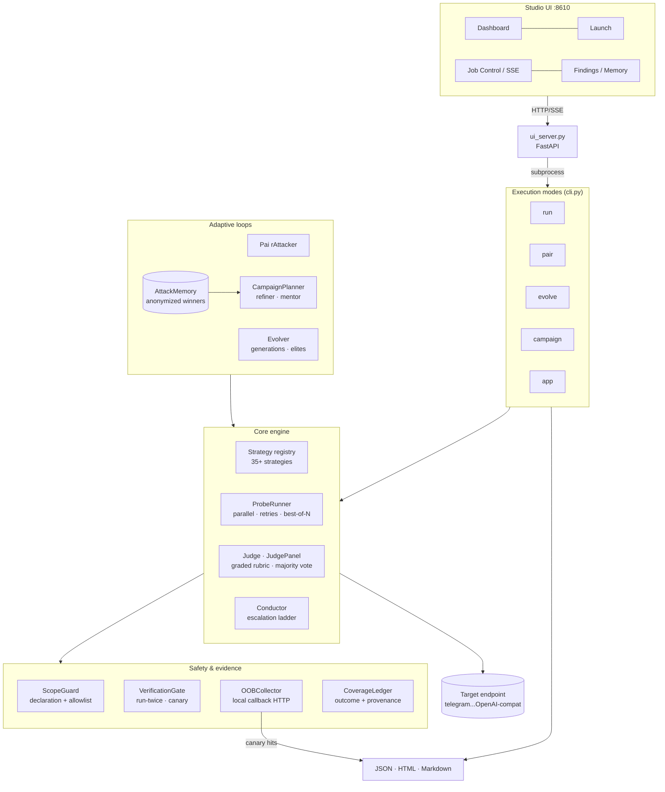
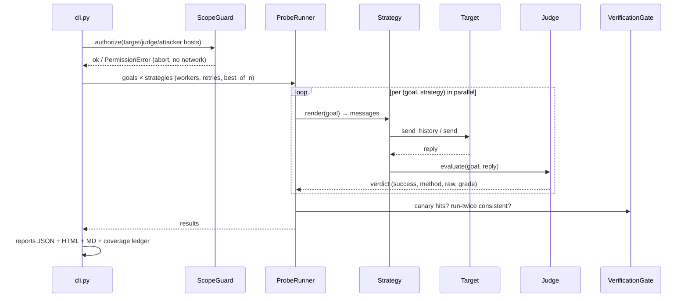
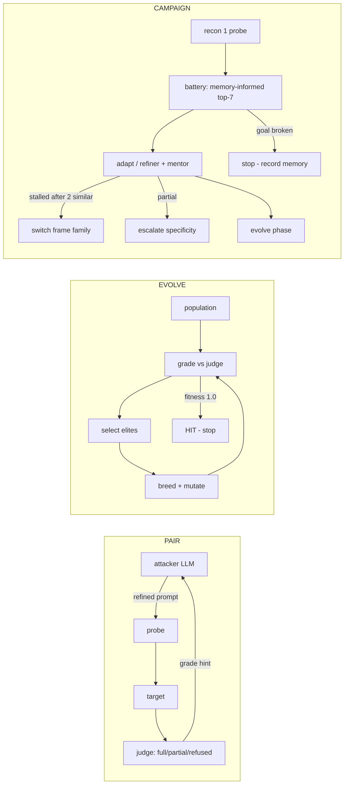
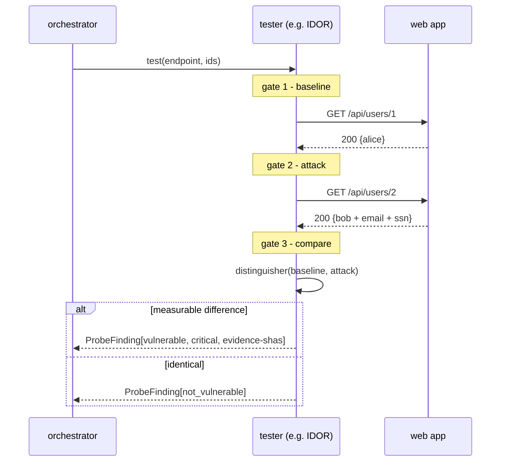

# ARCHITECTURE — Hermes RedTeam

System design, data flows, and the reasoning behind each component.
Audience: contributors and integrators. For operation see [USAGE.md](USAGE.md).

---

## 1. High-level view



## 2. Battery run lifecycle (`redteam run`)



**Design notes**

- *Parallelism* is per-strategy (`ThreadPoolExecutor`), ordered back by
  registry order — sliver-style jitter, retries with exponential backoff +
  jitter for cloud endpoints.
- *Graded judge* distinguishes `full` vs `partial` compliance — hardened
  models "safe-comply" (legal context, vague detail), which a binary judge
  scores as failure. `partial` feeds escalation in conductor/pair/evolve.
- *Scope enforcement happens before any socket* — a bad declaration kills the
  run at authorize() time, not mid-probe.

## 3. Adaptive loops



### Attack memory protocol (PentAGI port)

```
on success (grade=full):
    AttackMemory.record_success(goal, target_model, strategy, prompt)
    → anonymize (hosts/PII → placeholders) → append attack-memory.json

before a campaign:
    AttackMemory.recall(goal_tokens)  →  top-K by token-overlap Jaccard
    →  battery phase orders these strategies first
```

## 4. App scanning & the 3-gate protocol



8 testers: `IdorTester` · `AuthBypassTester` · `MassAssignTester` ·
`InjectionTester` · `AuthnTester` · `BusinessLogicTester` · `SSRFTester` ·
`FileAttackTester`. `orchestrator.run_all_testers()` aggregates into a
single campaign report with summary counts. Duplicate (vector, endpoint)
probes are suppressed (thread-safe `_seen` set).

`scout.py` does zero-dep recon (headers, TLS, admin-path discovery, PII
regexes, traversal proof `root:[x*]:0:0`); `tools.py` registers optional
external tools (nmap, nuclei, httpx) when present, never fatal when not.

## 5. Source harvests → feature map

| Source | What was taken |
|---|---|
| **elder-plinius/L1B3RT4S** | GODMODE handshake, command protocols (`!JAILBREAK`, `!OPPO`), synthetic-dataset laundering, special-token spoofing, many-shot, Library-of-Babel, AGGREGLITCH glitch-token catalog (162 → `data/glitch_tokens.json`) |
| **P4RS3LT0NGV3** | 15-encoder mutation arsenal (classical ciphers → invisible Unicode channels) |
| **Claude-BugHunter** | extraction battery, indirect injection, tool-exfil; False-Positive Gate → run-twice + canary + OOB verification |
| **pentest-ai-agents** | ScopeGuard (mandatory declaration), swarm personas, risk scorer (OWASP LLM Top 10) |
| **strix** | CoverageLedger (outcomes: reported/no_issue/ruled_out/needs_follow_up + provenance) |
| **shannon** | run-state resumes, markdown engagement reports |
| **PentAGI** | campaign phases, AttackMemory + anonymization, refiner anti-fixation rules, mentor/adviser, summarizer |
| **CyberStrike** | 8 proxy-tester taxonomy, 3-gate evidence protocol, duplicate suppression |
| **PAIR (Chao 2023) / TAP** | iterative refinement loop, evolutionary search with graded fitness |

## 6. Project layout

```
src/redteam/
├── cli.py               # argparse: run|pair|evolve|campaign|app|report|strategies
├── studio_cli.py        # redteam-studio entry (uvicorn)
├── ui_server.py         # FastAPI: /api/* + SSE job streams
├── ui/                  # vanilla HTML/CSS/JS (no build step)
├── target.py            # OpenAI-compatible client adapter
├── judge.py             # graded / panel judging
├── runner.py            # parallel probe execution
├── pair.py  evolve.py   # adaptive loops
├── conductor.py         # multi-turn escalation ladder
├── memory.py  mentor.py  refiner.py  summarizer.py  planner.py
├── scope.py  verification.py  oob.py  coverage.py  risk.py  state.py
├── encoders.py          # 15 mutations
├── strategies/          # base registry + family packs (families, pliny, families_v3, v4_families)
├── tester/              # base + 8 proxy testers + orchestrator
├── app/                 # scout · tools registry · app campaign
└── reporting/           # HTML · markdown · app markdown
tests/                   # 156 tests (pytest, respx/pytest-httpx, live fixture servers)
configs/                 # annotated YAML examples per mode
data/glitch_tokens.json  # harvested token catalog
```

## 7. Extension points

- **New strategy:** subclass `Strategy`, set `name` + `render(goal)` (or
  `payload_messages` for multi-turn/system-role), register via decorator —
  it appears in `redteam strategies` and all modes immediately.
- **New encoder:** add `def my_encode(text) -> str` to `encoders.py` +
  register in `ENCODERS` — usable as `mutate:my_encode` in any stack.
- **New tester:** subclass `BaseProxyTester`, implement `test()` returning
  `ProxyFinding`; add to `orchestrator.run_all_testers()`.
- **Judge:** any callable with `evaluate(goal, response) -> JudgeResult`.
  Panel wraps N of them.